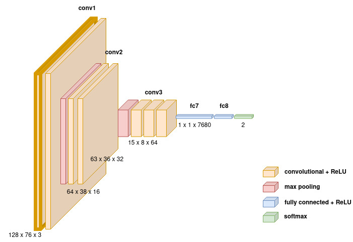

# BirdNet: Bird Voice Classifier

[](http://www.gnu.org/licenses/agpl-3.0)

## Introduction

This project is a bird classifier built using deep learning techniques. The classifier is trained on audio recordings of bird sounds to predict the species of birds present in the recordings. It leverages the power of convolutional neural networks (CNNs) to automatically learn features from the audio spectrograms and make accurate predictions.

Bird classification is a challenging task due to the diverse range of bird species and the variability in their vocalizations. Traditional methods of bird classification rely on manual feature engineering and classification algorithms, which can be time-consuming and may not generalize well to unseen data.

In this project, we use deep learning techniques to automate the process of feature extraction and classification. Convolutional neural networks (CNNs) have shown remarkable success in various audio classification tasks, including speech recognition and music classification. We apply similar techniques to the task of bird classification, leveraging the spectral patterns present in bird vocalizations.


## Model

## Getting Started

## Usage

### Command-Line Interface (CLI)

To train your model using the command-line interface, you can use the `train.py` script with the following options:

```bash
python train.py --epochs 10 --batch_size 64 --validation_split 0.1 --new_example True --quantity 100 200
```

- `--epochs`: Number of epochs for training (default: 5).
- `--batch_size`: Batch size for training (default: 32).
- `--validation_split`: Validation split ratio (default: 0.2).
- `--new_example`: Whether to generate new examples (default: True).
- `--quantity`: Quantity of new examples to generate (default: [100, 200]).

### Python API

You can also use the Python API to train your model programmatically. Here's an example:

```python
from train import Trainer
from dataset import Dataset

# Initialize Trainer Pipeline
trainer = Trainer()

# Load data using Dataset class
dataset = Dataset(X, y)  # Replace X and y with your actual data

# Preprocess data
X_train, y_train = dataset.preprocess(new_example=True, quantity=[100, 200])

# Train the model using TrainerPipeline
trainer.train_model(X_train, y_train, epochs=10, validation_split=0.1, batch_size=64)
```

#### Evaluating Audio Files

To evaluate audio files using the trained model, you can use the `evaluate.py` script with the following options:

```bash
python evaluate.py --model_path "path/to/saved_model" --audio_file "path/to/audio_file.wav" --output_file "predictions.csv"
```

- `--model_path`: Path to the saved TensorFlow model file.
- `--audio_file`: Path to the audio file to be evaluated.
- `--output_file`: Path to save the predictions CSV file.

### visualize

Visualizes spectrograms of audio signals with their corresponding labels.

## Usage

```python
import numpy as np
import matplotlib.pyplot as plt
from bird_classifier.utils import audio_to_spectrogram, visualize

# Example usage of audio_to_spectrogram
# Load audio data...
spectrogram = audio_to_spectrogram(audio)

# Example usage of visualize
# Define signals, labels, Y, row, col...
visualize(signals, labels, Y, row, col)
```


## Contributing

Contributions are welcome! If you have any ideas, suggestions, or bug fixes, please open an issue or submit a pull request.

## License

This project is licensed under the MIT License - see the [LICENSE](LICENSE) file for details.
```

Make sure to replace placeholders like `your-username`, `your-repo`, `train.py`, `audio-evaluation-pipeline`, `X`, `y`, etc., with actual values specific to your project.
